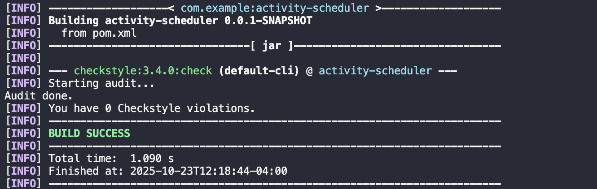
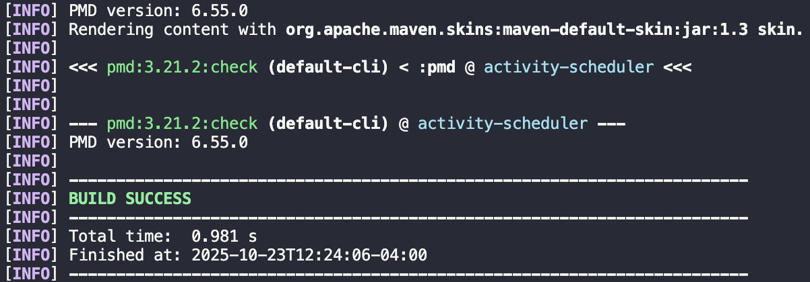
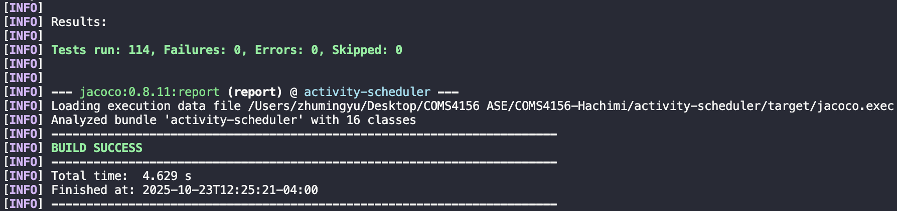
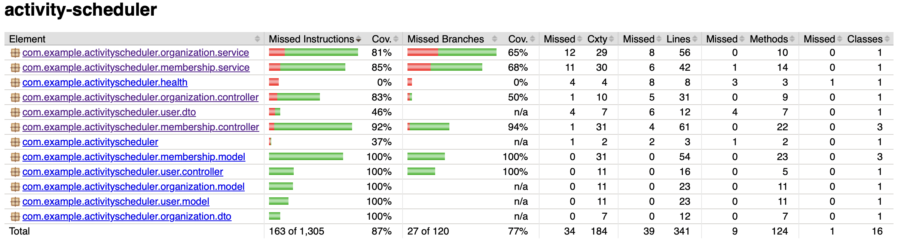

# Activity Scheduler

A Spring Boot REST API application for managing user activities and scheduling. This project provides a comprehensive backend service with user management capabilities, built with modern Java technologies and best practices.

## 🚀 Features

- **User Management**: Complete CRUD operations for user entities with email validation
- **Organization Management**: Full organization lifecycle management with creator tracking
- **Membership Management**: User-organization relationship management with status tracking
- **RESTful API**: Well-documented REST endpoints with OpenAPI/Swagger documentation
- **Database Integration**: MySQL database with JPA/Hibernate and composite keys
- **Health Monitoring**: Application and database health check endpoints
- **Code Quality**: Integrated with Checkstyle, PMD, and JaCoCo for code quality assurance
- **Testing**: Comprehensive unit and integration tests with 80%+ coverage target
- **CI/CD**: GitHub Actions workflow for automated testing and deployment

## 🛠️ Technology Stack

- **Java 17**
- **Spring Boot 3.5.6**
- **Spring Data JPA**
- **MySQL Database**
- **Maven** (Build Tool)
- **OpenAPI 3.0** (API Documentation)
- **JUnit 5** (Testing)
- **Mockito** (Mocking)
- **JaCoCo** (Code Coverage)
- **Checkstyle** (Code Style)
- **PMD** (Code Analysis)

## 📋 Prerequisites

- Java 17 or higher
- Maven 3.6+
- MySQL 8.0+
- Git

## 🚀 Getting Started

### 1. Clone the Repository

```bash
git clone https://github.com/YiliYu2002/COMS4156-Hachimi.git
cd activity-scheduler
```

### 2. Prerequisites Setup

**Required Software:**
- Java 17 or higher
- Maven 3.6+
- MySQL 8.0+
- Git

**Verify Installation:**
```bash
java -version  # Should show Java 17+
mvn -version  # Should show Maven 3.6+
mysql --version  # Should show MySQL 8.0+
```

### 3. Database Setup

**Option 1: Use Existing Database (Recommended)**
The application is configured to use a remote MySQL database. No local setup required. You will need to add your cloud database url and corresponding port, username, and password to `src/main/resources/application.yml`. See the [Configuration](#configuration) section below for detailed configuration options.

**Option 2: Local Database Setup**
If you want to use a local database, update `src/main/resources/application.yml`:

```yaml
spring:
  datasource:
    url: jdbc:mysql://localhost:3306/your_database
    username: your_username
    password: your_password
  jpa:
    hibernate:
      ddl-auto: update
```

### 4. Build the Application

```bash
# Clean and compile
mvn clean compile

# Run all tests
mvn test

# Build the JAR file
mvn clean package

# Run code quality checks
mvn checkstyle:check
mvn pmd:check
```

### 5. Run the Application

**Option 1: Maven Spring Boot Plugin (Recommended for Development)**
```bash
mvn spring-boot:run
```

**Option 2: JAR File**
```bash
# Build first
mvn clean package

# Run the JAR
java -jar target/activity-scheduler-0.0.1-SNAPSHOT.jar
```

**Option 3: Maven Wrapper (if available)**
```bash
./mvnw spring-boot:run
```

The application will start on `http://localhost:8080`

### 6. Verify Installation

**Health Checks:**
```bash
# Basic health check
curl http://localhost:8080/health/basic

# Database health check
curl http://localhost:8080/health/db
```

## 📚 API Documentation

### Interactive API Documentation (Swagger UI)

Once the application is running, access the interactive API documentation at:

- **Swagger UI**: `http://localhost:8080/swagger-ui.html`
- **OpenAPI JSON**: `http://localhost:8080/v3/api-docs`
- **OpenAPI YAML**: `http://localhost:8080/v3/api-docs.yaml`

### Static Documentation

#### REST API Documentation (OpenAPI)

For REST API documentation, you can generate static HTML documentation:

```bash
# 1. Start the application
mvn spring-boot:run

# 2. Generate OpenAPI spec (in another terminal)
curl http://localhost:8080/v3/api-docs.yaml > openapi.yaml

# 3. Generate static HTML documentation
npm install -g redoc-cli
redoc-cli build openapi.yaml --output docs/api-docs.html
```

#### Java API Documentation (Javadoc)

For Java code documentation, generate Javadoc:

```bash
# Generate Javadoc HTML documentation
mvn javadoc:javadoc

# View the documentation
open target/site/apidocs/index.html

# Or copy to github_resources for GitHub viewing
cp -r target/site/apidocs github_resources/
```

**Documentation Output:**
- **REST API Docs**: [`github_resources/api-docs.html`](github_resources/api-docs.html) (REST endpoints, schemas, examples)
- **Java API Docs**: [`github_resources/apidocs/index.html`](github_resources/apidocs/index.html) (Java classes, methods, parameters)

**Note**: To view the HTML documentation properly:
1. **Download the files** and open them in your browser
2. **Use GitHub Pages** (see setup instructions below)
3. **View locally** after cloning the repository

### API Overview

The Activity Scheduler API provides comprehensive REST endpoints for:

- **User Management**: Complete CRUD operations for user entities
- **Organization Management**: Full organization lifecycle management  
- **Membership Management**: User-organization relationship management
- **Health Monitoring**: Application and database health checks

**API Call Ordering Requirements:**
1. **Users must be created before organizations** - Organizations require a valid `createdBy` user ID
2. **Users and organizations must exist before memberships** - Memberships require valid user and organization IDs

For complete API documentation including all endpoints, request/response schemas, and examples, see the [REST API Documentation](github_resources/api-docs.html).

## 🏗️ Project Structure

```
activity-scheduler/
├── src/
│   ├── main/
│   │   ├── java/
│   │   │   └── com/example/activityscheduler/
│   │   │       ├── ActivitySchedulerApplication.java
│   │   │       ├── health/
│   │   │       │   └── HealthController.java
│   │   │       ├── user/
│   │   │       │   ├── controller/
│   │   │       │   │   └── UserController.java
│   │   │       │   ├── dto/
│   │   │       │   │   └── UserRegistrationRequest.java
│   │   │       │   ├── model/
│   │   │       │   │   └── User.java
│   │   │       │   └── repository/
│   │   │       │       └── UserRepository.java
│   │   │       ├── organization/
│   │   │       │   ├── controller/
│   │   │       │   │   └── OrganizationController.java
│   │   │       │   ├── dto/
│   │   │       │   │   └── OrganizationCreationRequest.java
│   │   │       │   ├── model/
│   │   │       │   │   └── Organization.java
│   │   │       │   ├── repository/
│   │   │       │   │   └── OrganizationRepository.java
│   │   │       │   └── service/
│   │   │       │       └── OrganizationService.java
│   │   │       ├── membership/
│   │   │       │   ├── controller/
│   │   │       │   │   └── MembershipController.java
│   │   │       │   ├── model/
│   │   │       │   │   ├── Membership.java
│   │   │       │   │   ├── MembershipId.java
│   │   │       │   │   └── MembershipStatus.java
│   │   │       │   ├── repository/
│   │   │       │   │   └── MembershipRepository.java
│   │   │       │   └── service/
│   │   │       │       └── MembershipService.java
│   │   │       ├── event/
│   │   │       │   ├── controller/
│   │   │       │   ├── model/
│   │   │       │   └── repository/
│   │   │       ├── conflict/
│   │   │       └── invitation/
│   │   └── resources/
│   │       ├── application.yml
│   │       └── application.properties
│   └── test/
│       └── java/
│           └── com/example/activityscheduler/
│               ├── ActivitySchedulerApplicationTests.java
│               ├── user/
│               │   ├── UserControllerTests.java
│               │   └── UserTests.java
│               ├── organization/
│               │   ├── OrganizationControllerTests.java
│               │   └── OrganizationTests.java
│               └── membership/
│                   ├── MembershipControllerTests.java
│                   ├── MembershipIdTests.java
│                   ├── MembershipServiceTests.java
│                   ├── MembershipStatusTests.java
│                   └── MembershipTests.java
├── .github/
│   └── workflow/
│       └── maven-ci.yaml
├── .gitattributes
├── .gitignore
├── google_checks.xml
├── mvnw
├── mvnw.cmd
└── pom.xml
```

## 📝 Database Schema

### Users Table

| Column | Type | Description |
|--------|------|-------------|
| `id` | CHAR(36) | Primary key (UUID) |
| `email` | VARCHAR(320) | User email (unique) |
| `display_name` | VARCHAR(255) | User display name |
| `is_active` | BOOLEAN | Account status |
| `created_at` | TIMESTAMP | Creation timestamp |

### Organizations Table

| Column | Type | Description |
|--------|------|-------------|
| `id` | CHAR(36) | Primary key (UUID) |
| `name` | VARCHAR(255) | Organization name (unique) |
| `created_by` | VARCHAR(36) | User ID of creator (foreign key) |
| `created_at` | TIMESTAMP | Creation timestamp |

### Memberships Table

| Column | Type | Description |
|--------|------|-------------|
| `org_id` | CHAR(36) | Organization ID (composite primary key) |
| `user_id` | CHAR(36) | User ID (composite primary key) |
| `status` | ENUM | Membership status (ACTIVE, INVITED, SUSPENDED) |
| `created_at` | TIMESTAMP | Creation timestamp |

**Note:** The `memberships` table uses a composite primary key (`org_id`, `user_id`) to ensure unique user-organization relationships.

### Membership Status Values

| Status | Description |
|--------|-------------|
| `ACTIVE` | User is an active member of the organization |
| `INVITED` | User has been invited but hasn't accepted yet |
| `SUSPENDED` | User's membership has been suspended |

## 🧪 Testing

### Run Tests

```bash
# Run all tests
mvn test

# Run tests with coverage
mvn clean test jacoco:report

# View coverage report
open target/site/jacoco/index.html
```

### Test Categories

**Unit Tests:**
- User entity tests
- Organization entity tests  
- Membership entity tests
- Service layer tests
- Controller tests

**Integration Tests:**
- API endpoint tests
- Database integration tests
- Repository tests

### Code Quality Checks

```bash
# Format code (Google Java Format)
mvn fmt:format

# Checkstyle (Google Java Style Guide)
mvn checkstyle:check

# PMD (Static code analysis)
mvn pmd:check

# Run all quality checks
mvn clean compile test checkstyle:check pmd:check
```

Below shows what the screenshots of successful checks:
1. Checkstyle

2. PMD static code analysis

3. Testing


### Test Coverage

The project uses JaCoCo for code coverage reporting:
- **Target Coverage:** 80%+ line coverage
- **Report Location:** `target/site/jacoco/index.html`
- **Coverage includes:** All main source files excluding generated code
- **Example JaCoCo report**


## 📊 Code Quality & Coverage

This project maintains high code quality standards with:

- **Checkstyle**: Google Java Style Guide compliance
- **PMD**: Static code analysis
- **JaCoCo**: Code coverage reporting
- **JUnit 5**: Comprehensive testing
- **Mockito**: Mock testing framework

## 🚀 CI/CD Pipeline

**Recommended GitHub Actions Workflow (`.github/workflows/maven-ci.yaml`):**
```yaml
name: Maven CI

on:
  push:
    branches: [ main ]
  pull_request:
    branches: [ main ]

jobs:
  test:
    runs-on: ubuntu-latest
    
    steps:
    - uses: actions/checkout@v3
    
    - name: Set up JDK 17
      uses: actions/setup-java@v3
      with:
        java-version: '17'
        distribution: 'temurin'
        
    - name: Cache Maven dependencies
      uses: actions/cache@v3
      with:
        path: ~/.m2
        key: ${{ runner.os }}-m2-${{ hashFiles('**/pom.xml') }}
        
    - name: Run tests
      run: mvn clean test
      
    - name: Run code quality checks
      run: mvn checkstyle:check pmd:check
      
    - name: Generate coverage report
      run: mvn jacoco:report
      
    - name: Upload coverage to Codecov
      uses: codecov/codecov-action@v3
```

**Pipeline Features:**
- Runs on every push and pull request
- Executes Maven build and tests
- Generates code coverage reports
- Ensures code quality standards
- Caches Maven dependencies for faster builds

## 🔧 Configuration

### Configuration Files

The project includes the following configuration files:

**Main Configuration:**
- `src/main/resources/application.yml` - Main application configuration
- `src/main/resources/application.properties` - Alternative properties format
- `pom.xml` - Maven project configuration
- `google_checks.xml` - Checkstyle configuration

### Application Properties

**Current Configuration (`application.yml`):**
We do not wish to expose our db configuration in a public GitHub repository
```yaml
spring:
  datasource:
    url: jdbc:mysql://{db_external_ip}/{db_name}
    username: {db_username}
    password: {db_password}
  jpa:
    hibernate:
      ddl-auto: none
    show-sql: true
    properties:
      hibernate:
        dialect: org.hibernate.dialect.MySQLDialect
  jackson:
    mapper:
      ACCEPT_CASE_INSENSITIVE_ENUMS: true

management:
  endpoints:
    web:
      exposure:
        include: health, info
  endpoint:
    health:
      show-details: always
info:
  build:
    name: activity-scheduler
    version: 0.0.1-SNAPSHOT
    group: com.example
    artifact: activity-scheduler
    description: Activity Scheduler application

server:
  port: 8080

# Logging Configuration
logging:
  level:
    com.example.activityscheduler: INFO
    org.springframework.web: DEBUG
  file:
    name: logs/activity-scheduler.log
    max-size: 10MB
    max-history: 5
    total-size-cap: 50MB
  pattern:
    file: "%d{yyyy-MM-dd HH:mm:ss} [%thread] %-5level %logger{36} - %msg%n"
    console: "%d{HH:mm:ss.SSS} [%thread] %-5level %logger{36} - %msg%n"
  logback:
    rollingpolicy:
      file-name-pattern: logs/activity-scheduler.%d{yyyy-MM-dd}.%i.log
      max-file-size: 10MB
      max-history: 5
      total-size-cap: 50MB

```

### Environment Variables

**Database Configuration:**
- `DB_USERNAME` - Database username
- `DB_PASSWORD` - Database password
- `DB_URL` - Database URL

**Server Configuration:**
- `SERVER_PORT` - Server port (default: 8080)

### Maven Configuration

**Key Maven Plugins:**
- `spring-boot-maven-plugin` - Spring Boot packaging
- `maven-checkstyle-plugin` - Code style checking
- `maven-pmd-plugin` - Static code analysis
- `jacoco-maven-plugin` - Code coverage reporting
- `fmt-maven-plugin` - Code formatting

### Code Quality Configuration

**Checkstyle:** Uses Google Java Style Guide (`google_checks.xml`)
**PMD:** Static code analysis with default rules
**JaCoCo:** Code coverage reporting with 80%+ target

## 📄 License

This project is licensed under the MIT License - see the [LICENSE](LICENSE) file for details.

## AI Tools Usage

This project utilized various AI tools to assist in development, testing, and documentation. All AI-generated code is clearly marked throughout the codebase.

### AI Tools Used

**1. ChatGPT (Free Tier)**
- **Source**: OpenAI ChatGPT (free tier with .edu email)
- **Usage**: Code review, debugging, and architectural guidance
- **Prompts**: 
  - "Review this Spring Boot controller for best practices"
  - "Help debug JPA composite key implementation"
  - "Suggest improvements for test coverage"
- **Generated Code**: 
  - Error handling improvements
  - Test case scenarios
  - Documentation templates

**2. Cursor AI (Education)**
- **Source**: Cursor IDE with education access
- **Usage**: Code refactoring, documentation generation, and README updates
- **Prompts**:
  - "Tell me how to generate static Java API and REST API documentations"
  - "Create database schema documentation"
  - "Update README with current project structure"
- **Generated Content**:
  - README.md sections
  - API endpoint documentation
  - Database schema tables

### AI-Generated Code Marking

We utilized AI to generate test cases in unit testing stage. After the AI generated tests, we 
thoroughly examined the test cases and confirmed that they cover most branches and use cases.
We also prompted AI tools to generate JAVADOC, the AI tools first read through our API definition 
and implemented the JAVADOCs accordingly. In addition, we prompted Cursor to generate this README.md 
to include an overall summary of our project.

## 👥 Authors

- **AlexZhu2** - *User, Organization, Membership Development* - [AlexZhu2](https://github.com/AlexZhu2)
- **YiliYu2002** - *Database Management, Product Manager* - [YiliYu2002](https://github.com/YiliYu2002)
- **Doglily3** - *Organization Development* - [Doglily3](https://github.com/Doglily3)
- **jieji09** - *Event Development* - [jieji09](https://github.com/jieji09)