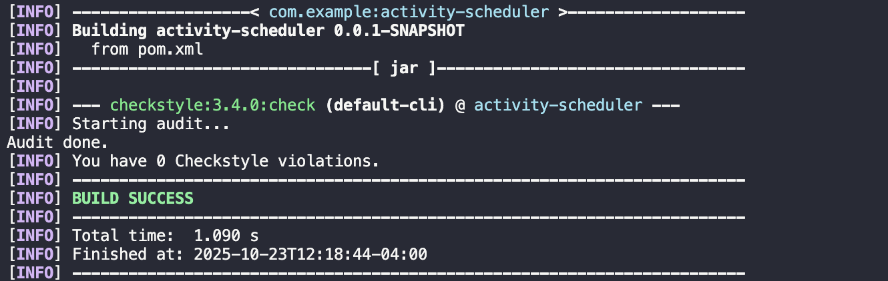
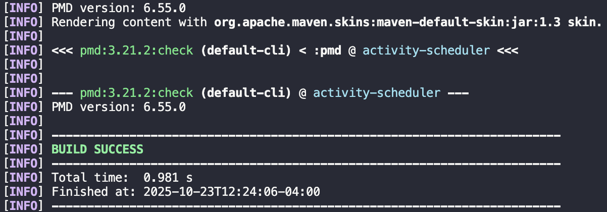
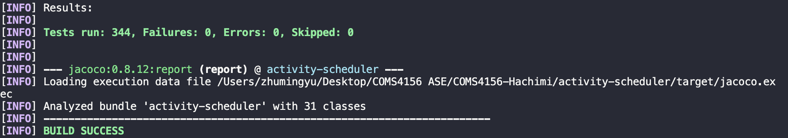
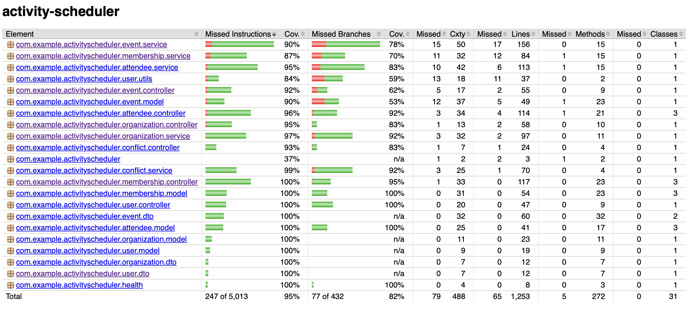

# Team Hachimi — Event Scheduler API

## Part 1 — Team/Repo/Stack Status

**Language / Platform:** Java 17 + macOS

**GitHub Repository:** https://github.com/YiliYu2002/COMS4156-Hachimi

**Status Change:** N/A

**Team Members:**
- **AlexZhu2** - User, Organization, Membership Development; Implemented conflict detection, enhanced client application, deployed backend to GCP - [AlexZhu2](https://github.com/AlexZhu2)
- **YiliYu2002** - Database Management, Product Manager; Implemented conflict detection, deployed backend to GCP - [YiliYu2002](https://github.com/YiliYu2002)
- **Doglily3** - Organization Development; Enhanced event functionality - [Doglily3](https://github.com/Doglily3)
- **jieji09** - Event Development; Developed client application - [jieji09](https://github.com/jieji09)

**Project Management:** Tasks are tracked using GitHub Projects. [Link to GitHub Projects](https://github.com/YiliYu2002/COMS4156-Hachimi/projects)

## Part 2 — Service Overview

### What the Service Does

The Activity Scheduler is a REST API service that enables groups and organizations to coordinate events, meetings, and activities. It provides a comprehensive scheduling system with the following capabilities:

**Core Features:**
- **User Management**: Users can register and manage their profiles
- **Organization Management**: Create and manage organizations/teams
- **Event Management**: Create, update, and delete events with scheduling details
- **Membership Management**: Manage user memberships in organizations with different status levels (ACTIVE, INVITED, SUSPENDED)
- **Event Invitations**: Invite users to events and track RSVP status (PENDING, YES, NO)
- **Conflict Detection**: Automatically detect scheduling conflicts when users have overlapping events
- **Multi-Client Support**: Multiple client applications can connect simultaneously and share data

**Data Model:**
The service maintains a database with the following entities:
- **Users**: User accounts with email and display name
- **Organizations**: Groups or teams that users can belong to
- **Events**: Scheduled activities with title, description, start/end times, and capacity
- **Memberships**: Relationships between users and organizations with status tracking
- **Attendees**: Event invitations with RSVP status tracking

**API Design:**
The service provides a RESTful API following OpenAPI 3.0 standards, making it easy for developers to integrate into web and mobile applications. All endpoints use JSON for request/response formats and standard HTTP status codes.

### Implementation Status vs. Proposal

**Implemented Features:**
- ✅ User management (registration, login, CRUD operations)
- ✅ Organization management (create, list, update, delete)
- ✅ Membership management (create, list with status tracking)
- ✅ Event management (create, list, update, delete, view by organization/user)
- ✅ Event attendee management (invite, RSVP status updates, view attendees)
- ✅ Conflict detection (automatic detection of scheduling conflicts)
- ✅ Role-based permissions (admin, user roles)
- ✅ RESTful API with OpenAPI 3.0 documentation
- ✅ Database persistence (MySQL for production, H2 for local development)
- ✅ Health monitoring endpoints
- ✅ Multi-client support (multiple client instances can run simultaneously)

**Partially Implemented / Future Enhancements:**
- ⚠️ **Notification delivery mechanisms (email/webhook)**: Currently not implemented. The service architecture supports this, but actual email/webhook delivery is planned for future iterations.
- ⚠️ **Third-party authentication(OAuth2)**: This API service has not integrated any authentication.

**Note:** The core functionality matches the proposal. The service provides a fully functional group activity scheduling API with conflict detection and multi-client support. Advanced features like external calendar integration and notification delivery are architectural extensions that can be added without changing the core API.

---

## 🚀 Getting Started

### Prerequisites

- Java 17 or higher
- Maven 3.6+
- MySQL 8.0+ (for production) or H2 (for local development)
- Git

### 1. Clone the Repository

```bash
git clone https://github.com/YiliYu2002/COMS4156-Hachimi.git
cd COMS4156-Hachimi
```

### 2. Build and Run the Service

**Option A: GCP MySQL (Production/Default)**
```bash
cd activity-scheduler
mvn spring-boot:run
```

**Option B: Local H2 (Development)**
```bash
cd activity-scheduler
mvn spring-boot:run -Dspring-boot.run.profiles=local
```

The service will start on `http://localhost:8080`

### 3. Verify Installation

```bash
# Health check
curl http://localhost:8080/health/basic

# Should return: "Application is running"
```

### 4. Build and Run the Client

```bash
cd activity-scheduler-client
mvn clean package
java -jar target/activity-scheduler-client-1.0.0-jar-with-dependencies.jar
```

---

## 📚 API Documentation

### Interactive API Documentation

When the service is running, access interactive API documentation:

- **Swagger UI**: `http://localhost:8080/swagger-ui.html`
- **OpenAPI JSON**: `http://localhost:8080/v3/api-docs`
- **OpenAPI YAML**: `http://localhost:8080/v3/api-docs.yaml`

### Static API Documentation (GitHub Pages)

**OpenAPI Documentation:**
- **GitHub Pages URL**: `https://yiliyu2002.github.io/COMS4156-Hachimi/api-docs.html`
- **Local File**: `github_resources/api-docs.html`
- **Format**: OpenAPI 3.0 HTML documentation
- **Contents**: All REST endpoints, request/response schemas, status codes, examples

**Java API Documentation (Javadoc):**
- **GitHub Pages URL**: `https://yiliyu2002.github.io/COMS4156-Hachimi/apidocs/`
- **Local Directory**: `github_resources/apidocs/`
- **Contents**: Java classes, methods, parameters, return types, package documentation

**OpenAPI Specification:**
- **Location**: `openapi.yaml` (root directory)
- **Format**: OpenAPI 3.0 YAML specification
- **GitHub Pages**: Can be accessed directly from repository

### API Entry Points
API entry points can be found at `https://yiliyu2002.github.io/COMS4156-Hachimi/api-docs.html`

#### Base URL
- **Local Development**: `http://localhost:8080`
- **Production**: Configure via `application.yml` or environment variables

#### API Call Ordering Requirements

**Important:** Some endpoints must be called in a specific order:

1. **Users must be created before organizations**
   - Organizations require a valid `createdBy` user ID
   - Call `POST /api/users/register` first

2. **Users and organizations must exist before memberships**
   - Memberships require valid user and organization IDs
   - Create users and organizations before creating memberships

3. **Organizations must exist before events**
   - Events require a valid `orgId`
   - Create organizations before creating events

4. **Events must exist before inviting attendees**
   - Attendees require a valid event ID
   - Create events before inviting attendees

#### Status Codes

- `200 OK` - Request successful
- `201 Created` - Resource created successfully
- `204 No Content` - Resource deleted successfully
- `400 Bad Request` - Invalid request data
- `404 Not Found` - Resource not found
- `409 Conflict` - Resource conflict (e.g., duplicate email)
- `500 Internal Server Error` - Server error

For complete API documentation including all endpoints, request/response schemas, status codes, and examples, see:
- **Interactive**: `http://localhost:8080/swagger-ui.html` (when service is running)
- **Static (GitHub Pages)**: `https://yiliyu2002.github.io/COMS4156-Hachimi/api-docs.html`
- **Javadoc (GitHub Pages)**: `https://yiliyu2002.github.io/COMS4156-Hachimi/apidocs/`

---

## 🧪 Code Quality & Testing

### Code Quality Checks

**Checkstyle (Google Java Style Guide):**
```bash
cd activity-scheduler
mvn checkstyle:check
```

**PMD (Static Code Analysis):**
```bash
mvn pmd:check
```

**Code Formatting:**
```bash
mvn fmt:format
```

**Run All Quality Checks:**
```bash
mvn clean compile test checkstyle:check pmd:check
```

### Testing

**Unit and Integration Tests:**
```bash
cd activity-scheduler

# Run all tests
mvn test

# Run tests with coverage
mvn clean test jacoco:report

# View coverage report
open target/site/jacoco/index.html
```

**Code Coverage:**
- **Target**: 80%+ branch coverage
- **Tool**: JaCoCo
- **Report Location**: `target/site/jacoco/index.html`

### Code Quality Screenshots

**Code Quality Reports:**









**Image Files:**
- Checkstyle: `github_resources/checkstyle.png`
- PMD: `github_resources/pmd.png`
- Testing: `github_resources/testing.png`
- JaCoCo: `github_resources/jacoco.png`

---

## 🔄 Continuous Integration & Deployment (CI/CD)

### CI Configuration

**Location:** `.github/workflows/maven-ci.yaml`

**Workflow:**
```yaml
name: Java CI with Maven

on:
  push:
    branches: [ main ]
  pull_request:
    branches: [ main ]

jobs:
  build:
    runs-on: ubuntu-latest
    steps:
      - Checkout repository
      - Set up JDK 17
      - Build and verify (mvn clean verify)
      - Run Checkstyle (mvn checkstyle:check)
      - Run PMD (mvn pmd:check)
      - Run Tests with Coverage (mvn test jacoco:report)
      - Upload JaCoCo coverage report
```

### Automated Checks

The CI pipeline automatically runs on every push to `main` and on pull requests:

1. **Maven Build** - Compiles the project and verifies dependencies
2. **Checkstyle** - Google Java Style Guide compliance checking
3. **PMD** - Static code analysis for bug detection
4. **Unit Tests** - JUnit 5 tests with Mockito
5. **Code Coverage** - JaCoCo coverage reporting (target: 80%+)

### CI Reports

CI reports are available in:
- **GitHub Actions**: View workflow runs in the "Actions" tab of the repository
- **Coverage Reports**: Uploaded as artifacts in each CI run
- **Code Quality Screenshots**: See `github_resources/` directory

### Manual Testing

**End-to-End Testing** is run manually (see [Client Application](#client-application) section) because:
- The client is an interactive command-line application
- Tests require user input and multiple terminal sessions
- Manual execution allows for exploratory testing

All other testing (unit tests, integration tests) is automated in the CI pipeline.

---

## 💻 Client Application

### Client Code Location

The client code is located in the same GitHub repository in the `activity-scheduler-client/` directory:

```
COMS4156-Hachimi/
├── activity-scheduler/          # Service code
└── activity-scheduler-client/   # Client code
    ├── src/
    │   └── main/java/com/example/client/
    │       ├── ActivitySchedulerClient.java
    │       ├── api/
    │       │   └── ApiClient.java
    │       └── model/            # Data models
    ├── pom.xml
    ├── README.md                 # Client-specific documentation
    └── ARCHITECTURE.md           # Client architecture details
```

**GitHub Repository Link:** The client code is accessible at: https://github.com/YiliYu2002/COMS4156-Hachimi/tree/main/activity-scheduler-client

### What the Client Does

The Activity Scheduler Client is a command-line application that demonstrates how to interact with the Activity Scheduler REST API service. It provides:

- **User Management**: Registration and login with email/display name
- **Organization Management**: Create, list, view, update, and delete organizations
- **Membership Management**: Create memberships and list user's memberships
- **Event Management**: Create, list, update, delete events; view events by organization/user
- **Event Attendee Management**: Invite attendees, update RSVP status, view event attendees
- **Conflict Detection**: Automatic detection of scheduling conflicts when creating events

The client serves as both a demonstration tool and a reference implementation for third-party developers.

### How to Build and Run the Client

#### Prerequisites

- Java 17 or higher
- Maven 3.6+
- Activity Scheduler service running and accessible

#### Build the Client

```bash
# Navigate to client directory
cd activity-scheduler-client

# Build the client application
mvn clean package
```

This creates an executable JAR file: `target/activity-scheduler-client-1.0.0-jar-with-dependencies.jar`

#### Run the Client

**Default (Connects to localhost:8080):**

```bash
java -jar target/activity-scheduler-client-1.0.0-jar-with-dependencies.jar
```

**Custom Service URL:**

```bash
# Specify service URL as command-line argument
java -jar target/activity-scheduler-client-1.0.0-jar-with-dependencies.jar https://your-service-url.com

# Or use environment variable
export SERVICE_URL=https://your-service-url.com
java -jar target/activity-scheduler-client-1.0.0-jar-with-dependencies.jar
```

### How to Connect Client Instances to the Service

1. **Start the Service:**

   **Option A: GCP MySQL (Production/Default)**
   ```bash
   cd activity-scheduler
   mvn spring-boot:run
   ```

   **Option B: Local H2 (Development)**
   ```bash
   cd activity-scheduler
   mvn spring-boot:run -Dspring-boot.run.profiles=local
   ```

2. **Start Client Instances:**

   In separate terminals, run:
   ```bash
   cd activity-scheduler-client
   java -jar target/activity-scheduler-client-1.0.0-jar-with-dependencies.jar
   ```

   Each client instance will:
   - Prompt for email and display name
   - Register or login the user
   - Receive a unique User ID (UUID)
   - Connect to the same service instance

### Multiple Client Support

The service supports multiple client instances running simultaneously. The service is **stateless** and uses **User ID-based identification** to distinguish between different clients and users.

#### How Clients are Distinguished

**User ID Mechanism:**
1. When a client starts, it prompts for email and display name
2. The service checks if a user with that email exists:
   - **If user exists**: Returns the existing User ID (same email always returns same User ID - idempotent)
   - **If user doesn't exist**: Creates a new user and assigns a unique UUID (User ID)
3. Each client instance stores its `currentUserId` after login/registration
4. All API calls include the User ID to identify which client/user is making the request

**Code Verification:**
- User registration is idempotent: Same email always returns the same User ID (see `UserController.register()`)
- User ID is a UUID stored in the database with unique email constraint
- All operations include User ID in request bodies (`createdBy` field) or path parameters

**Data Model:**
- **Shared Data**: Organizations, Events, Memberships, and Attendees are stored in a shared database accessible to all clients
- **User Attribution**: All data is tagged with the creator's User ID (`createdBy` field in organizations/events)
- **User-Specific Queries**: Clients can filter data by User ID using dedicated endpoints:
  - `/api/events/user/{userId}` - Events created by a specific user
  - `/api/memberships/user/{userId}` - Memberships for a specific user
  - `/api/attendees/user/{userId}` - Events a user is invited to

**Concurrent Request Handling:**
- The service is stateless - no server-side sessions
- Each HTTP request is independent and includes User ID
- Spring Boot handles concurrent requests automatically (thread-safe)
- Database transactions ensure data consistency for concurrent operations
- Multiple clients can create/modify resources simultaneously without conflicts (except for duplicate constraints like email or organization name)

#### How to Verify Multi-Client Support

**Quick Test:**
1. Start the service: `cd activity-scheduler && mvn spring-boot:run`
2. Run client instance 1 in terminal 1:
   ```bash
   cd activity-scheduler-client
   java -jar target/activity-scheduler-client-1.0.0-jar-with-dependencies.jar
   # Register as: alice@test.com
   ```
3. Run client instance 2 in terminal 2:
   ```bash
   cd activity-scheduler-client
   java -jar target/activity-scheduler-client-1.0.0-jar-with-dependencies.jar
   # Register as: bob@test.com
   ```
4. From client 1: Create an organization "Acme Corp"
5. From client 2: List all organizations - you should see "Acme Corp" created by client 1
6. From client 1: Create an event "Team Meeting"
7. From client 2: List all events - you should see "Team Meeting" created by client 1
8. From client 2: List "My Events" - should be empty (no events created by bob@test.com)
9. Both clients can work with the same data simultaneously

**Expected Behavior:**
- ✅ Both clients can connect simultaneously
- ✅ Data created by one client is immediately visible to the other
- ✅ Each client maintains its own User ID
- ✅ User-specific queries return correct filtered results
- ✅ Concurrent operations (e.g., both clients creating events) work correctly

**Technical Details:**
- Each user gets a unique UUID that persists across sessions (same email = same User ID)
- User ID is stored in the database with email as unique constraint
- Organizations and events are shared but attributed to their creator via `createdBy` field
- "My Events" endpoint filters by User ID: `/api/events/user/{userId}`
- "My Memberships" endpoint filters by User ID: `/api/memberships/user/{userId}`
- Service uses Spring Boot's default thread pool for handling concurrent requests
- Database (MySQL/H2) handles concurrent transactions with proper isolation levels

### End-to-End Client/Service Testing

We have implemented comprehensive end-to-end tests where the client exercises the functionality of the service. These tests are **manually executed** using a detailed checklist.

#### Test Documentation

See [E2E_TESTING.md](E2E_TESTING.md) for the complete end-to-end testing checklist.

#### Test Coverage

The end-to-end tests cover:

1. **Service Health Check** - Verify service is running and accessible
2. **User Registration** - Register new users
3. **User Login** - Login with existing users
4. **Organization Management** - Create, list, view, update, delete organizations
5. **Membership Management** - Create memberships, list user memberships, update status
6. **Event Management** - Create, list, view, update, delete events; view by organization/user
7. **Event Attendee Management** - Invite attendees, update RSVP, view attendees
8. **Conflict Detection** - Check conflicts among accepted events, check conflicts with pending events
9. **Multi-Client Testing** - Verify multiple clients can run simultaneously
10. **Error Handling** - Invalid inputs, service unavailable scenarios, duplicate resources, authorization failures

#### Running End-to-End Tests

**Prerequisites:**
1. Service is running (see [How to Connect Client Instances](#how-to-connect-client-instances-to-the-service))
2. Client is built (see [How to Build and Run the Client](#build-the-client))

**Test Execution:**
1. Follow the checklist in [E2E_TESTING.md](E2E_TESTING.md)
2. Execute each test case manually
3. Record results (Pass/Fail) and notes
4. Verify expected outcomes match actual results

**Why Manual Testing:**
End-to-end tests are run manually because:
- The client is an interactive command-line application
- Tests require user input and verification of output
- Some scenarios require multiple terminals and coordinated actions
- Manual testing allows for exploratory testing and edge case discovery

The checklist format ensures tests can be re-run consistently with the same inputs and expected outcomes.

**Total Test Cases:** 36 tests covering all API endpoints and their outcomes (success and error scenarios)

### Third-Party Client Development

This section provides comprehensive guidance for developers who want to build their own client applications to interact with the Activity Scheduler service.

#### 1. Understanding the API

**API Documentation Resources:**
- **Interactive Swagger UI**: Access at `http://localhost:8080/swagger-ui.html` when the service is running
- **OpenAPI Specification**: See `openapi.yaml` in the root directory for complete API schema
- **Static Documentation (GitHub Pages)**: `https://yiliyu2002.github.io/COMS4156-Hachimi/api-docs.html`
- **Java API Documentation (Javadoc - GitHub Pages)**: `https://yiliyu2002.github.io/COMS4156-Hachimi/apidocs/`

**Base URL:**
- **Local Development**: `http://localhost:8080`
- **Production**: Configure based on your deployment (see service URL configuration)

**API Version:**
- Current API version: v0 (as specified in OpenAPI spec)
- All endpoints are under `/api/` prefix

#### 2. API Authentication/Identification

The service uses **User ID-based identification** (not traditional authentication tokens):

**Registration/Login Flow:**
1. **Check if user exists**: `GET /api/users/exists?email={email}` returns boolean
2. **If user doesn't exist**: `POST /api/users/register` with email and displayName
3. **If user exists**: Retrieve user via `GET /api/users` and filter by email, or use `GET /api/users/{id}` if you have the ID
4. **Store User ID**: Save the returned UUID (User ID) for all subsequent requests

**User ID Usage:**
- Include User ID in request bodies for operations that require user identification:
  - `createdBy` field in organization/event creation
  - `userId` field in membership/attendee creation
- Some endpoints require User ID in headers (e.g., `X-User-Id` header for delete operations)
- Use User ID in path parameters for user-specific queries (e.g., `/api/events/user/{userId}`)

**Example Registration Flow:**
```bash
# Step 1: Check if user exists
GET /api/users/exists?email=user@example.com
Response: false

# Step 2: Register new user
POST /api/users/register
Content-Type: application/json
{
  "email": "user@example.com",
  "displayName": "John Doe"
}

# Response includes User ID
Response: 200 OK
{
  "id": "550e8400-e29b-41d4-a716-446655440000",
  "email": "user@example.com",
  "displayName": "John Doe",
  "active": true,
  "createdAt": "2025-12-01T10:00:00"
}

# Step 3: Use User ID in subsequent requests
POST /api/organizations/create
Content-Type: application/json
{
  "name": "My Organization",
  "createdBy": "550e8400-e29b-41d4-a716-446655440000"
}
```

**Important Notes:**
- Same email always returns the same User ID (idempotent registration)
- User ID is a UUID string (36 characters)
- No password or token required - identification is based on email/User ID

#### 3. HTTP Client Setup

**Recommended HTTP Client Libraries:**

**Java:**
```java
// Java 11+ built-in HttpClient
import java.net.http.HttpClient;
import java.net.http.HttpRequest;
import java.net.http.HttpResponse;

HttpClient client = HttpClient.newHttpClient();
HttpRequest request = HttpRequest.newBuilder()
    .uri(URI.create("http://localhost:8080/api/users"))
    .GET()
    .build();
HttpResponse<String> response = client.send(request, HttpResponse.BodyHandlers.ofString());
```

**Python:**
```python
import requests

response = requests.get('http://localhost:8080/api/users')
users = response.json()
```

**JavaScript/Node.js:**
```javascript
// Using fetch (Node.js 18+)
const response = await fetch('http://localhost:8080/api/users');
const users = await response.json();

// Using axios
const axios = require('axios');
const response = await axios.get('http://localhost:8080/api/users');
```

**cURL (for testing):**
```bash
curl -X GET http://localhost:8080/api/users
curl -X POST http://localhost:8080/api/users/register \
  -H "Content-Type: application/json" \
  -d '{"email":"user@example.com","displayName":"John Doe"}'
```

#### 4. Request/Response Format

**Content Type:**
- **Request**: Always use `Content-Type: application/json` for POST/PUT requests
- **Response**: All responses are JSON with `Content-Type: application/json`

**Request Body Format:**
- All request bodies must be valid JSON
- Follow the schemas defined in `openapi.yaml`
- Required fields must be included (see OpenAPI spec for details)

**Response Format:**
- Success responses (200, 201): JSON object or array matching the resource schema
- Error responses (400, 404, 409, 500): May include error message in response body

**Date/Time Format:**
- All timestamps use ISO 8601 format: `yyyy-MM-ddTHH:mm:ss` (e.g., `2025-12-01T10:00:00`)
- Timezone: UTC (no timezone offset in timestamps)

#### 5. HTTP Status Codes

Handle all possible status codes:

- **200 OK**: Request successful, resource returned
- **201 Created**: Resource created successfully, resource returned
- **204 No Content**: Resource deleted successfully (no response body)
- **400 Bad Request**: Invalid input data - check request body format and required fields
- **404 Not Found**: Resource doesn't exist - verify IDs are correct
- **409 Conflict**: Duplicate resource (e.g., email already exists, organization name already exists)
- **500 Internal Server Error**: Server error - retry or contact support

#### 6. Multi-Client Support

The service is designed to support multiple client instances simultaneously:

**How It Works:**
1. Each client instance maintains its own User ID (obtained via registration/login)
2. All data (organizations, events, memberships) is shared across all clients
3. User-specific operations filter by User ID (e.g., "My Events" shows only events created by that user)
4. No client-side coordination needed - all coordination happens through the service

**Implementation Requirements:**
- Store the User ID after registration/login in your client application
- Include User ID in request bodies for operations that require user identification
- Use User ID in path parameters for user-specific queries
- Handle concurrent requests gracefully (service handles concurrency)

#### 7. Complete API Endpoint Reference

See the [API Documentation](#api-documentation) section above for the complete list of all API endpoints.

#### 8. Reference Implementation

Study the provided Java client as a reference implementation:

**Location**: `activity-scheduler-client/src/main/java/com/example/client/`

**Key Files:**
- `ActivitySchedulerClient.java` - Main client application with CLI interface
- `api/ApiClient.java` - HTTP client wrapper demonstrating API calls
- `model/` - Data models matching API schemas (User, Organization, Event, etc.)

**Key Patterns to Study:**
- User registration/login flow
- Error handling and retry logic
- JSON serialization/deserialization
- Date/time parsing
- Multi-client session management

#### 9. Testing Your Client

**Local Testing:**
1. Start the service: `cd activity-scheduler && mvn spring-boot:run`
2. Test your client against the service
3. Use the end-to-end test checklist in `E2E_TESTING.md` as a guide
4. Verify all API endpoints work correctly

**Multi-Client Testing:**
1. Run multiple instances of your client simultaneously
2. Verify data created by one client is visible to others
3. Test concurrent operations
4. Verify user-specific queries return correct results

#### 10. Best Practices

**Error Handling:**
- Always check HTTP status codes
- Provide user-friendly error messages
- Handle network errors gracefully (timeouts, connection failures)
- Implement retry logic for transient failures

**Data Validation:**
- Validate input data before sending requests
- Check required fields are present
- Validate date/time formats
- Verify UUID formats for IDs

**Security:**
- Never expose sensitive data in error messages
- Validate all user inputs
- Use HTTPS in production environments
- Implement rate limiting if making many requests

#### 11. Getting Help

**Documentation:**
- This README
- `E2E_TESTING.md` - End-to-end testing guide
- `activity-scheduler-client/README.md` - Reference client documentation
- `activity-scheduler-client/ARCHITECTURE.md` - Client architecture details
- Swagger UI at `http://localhost:8080/swagger-ui.html`
- GitHub Pages: API docs and Javadoc (see [API Documentation](#api-documentation) section)

**Code Examples:**
- Reference implementation in `activity-scheduler-client/`
- OpenAPI specification in `openapi.yaml`
- API documentation on GitHub Pages

---

## 📝 Database Schema

### Users Table

| Column | Type | Description |
|--------|------|-------------|
| `id` | CHAR(36) | Primary key (UUID) |
| `email` | VARCHAR(320) | User email (unique) |
| `display_name` | VARCHAR(255) | User display name |
| `is_active` | BOOLEAN | Account status |
| `created_at` | TIMESTAMP | Creation timestamp |

### Organizations Table

| Column | Type | Description |
|--------|------|-------------|
| `id` | CHAR(36) | Primary key (UUID) |
| `name` | VARCHAR(255) | Organization name (unique) |
| `created_by` | CHAR(36) | User ID of creator (foreign key) |
| `created_at` | TIMESTAMP | Creation timestamp |

### Memberships Table

| Column | Type | Description |
|--------|------|-------------|
| `org_id` | CHAR(36) | Organization ID (composite primary key) |
| `user_id` | CHAR(36) | User ID (composite primary key) |
| `status` | ENUM | Membership status (ACTIVE, INVITED, SUSPENDED) |
| `created_at` | TIMESTAMP | Creation timestamp |

### Events Table

| Column | Type | Description |
|--------|------|-------------|
| `id` | CHAR(36) | Primary key (UUID) |
| `org_id` | CHAR(36) | Organization ID (foreign key) |
| `title` | VARCHAR(255) | Event title |
| `description` | TEXT | Event description |
| `start_at` | TIMESTAMP | Event start time |
| `end_at` | TIMESTAMP | Event end time |
| `capacity` | INTEGER | Maximum attendees (nullable) |
| `created_by` | CHAR(36) | User ID of creator (foreign key) |
| `created_at` | TIMESTAMP | Creation timestamp |

### Event Attendees Table

| Column | Type | Description |
|--------|------|-------------|
| `event_id` | CHAR(36) | Event ID (composite primary key) |
| `user_id` | CHAR(36) | User ID (composite primary key) |
| `rsvp_status` | ENUM | RSVP status (PENDING, YES, NO) |
| `created_at` | TIMESTAMP | Creation timestamp |

---

## 🛠️ Technology Stack

- **Language**: Java 17 LTS
- **Framework**: Spring Boot 3.5.6
- **Build Tool**: Maven 3.9.5
- **Database**: MySQL 8.0+ (production), H2 (local development)
- **API Documentation**: OpenAPI 3.0 / Swagger
- **Testing**: JUnit 5, Mockito
- **Code Coverage**: JaCoCo
- **Code Quality**: Checkstyle (Google Style Guide), PMD
- **CI/CD**: GitHub Actions

---

## 📄 Generating Static Documentation for GitHub Pages

### Generating OpenAPI HTML Documentation

**Method 1: Using Swagger UI (Recommended)**

1. Install `redoc-cli`:
   ```bash
   npm install -g redoc-cli
   ```

2. Generate HTML from OpenAPI spec:
   ```bash
   redoc-cli bundle openapi.yaml -o github_resources/api-docs.html
   ```

**Method 2: Using Swagger Codegen**

1. Download Swagger Codegen:
   ```bash
   wget https://repo1.maven.org/maven2/io/swagger/codegen/v3/swagger-codegen-cli/3.0.46/swagger-codegen-cli-3.0.46.jar -O swagger-codegen-cli.jar
   ```

2. Generate HTML:
   ```bash
   java -jar swagger-codegen-cli.jar generate \
     -i openapi.yaml \
     -l html \
     -o github_resources/
   ```

**Method 3: Using Online Tools**

1. Go to https://editor.swagger.io/
2. Import `openapi.yaml`
3. Export as HTML
4. Save to `github_resources/api-docs.html`

### Generating Javadoc

**Generate Javadoc:**
```bash
cd activity-scheduler
mvn javadoc:javadoc
```

**Copy to GitHub Resources:**
```bash
# Copy generated Javadoc to github_resources directory
cp -r target/site/apidocs github_resources/
```

**Alternative: Generate directly to github_resources:**
```bash
cd activity-scheduler
mvn javadoc:javadoc -DreportOutputDirectory=../github_resources
```

### Deploying to GitHub Pages

**Setup GitHub Pages:**

1. Go to repository Settings → Pages
2. Source: Select "Deploy from a branch"
3. Branch: Select `main` (or `gh-pages` if you prefer)
4. Folder: Select `/ (root)` or `/docs` if you use a docs folder

**Directory Structure for GitHub Pages:**

If deploying from root:
```
COMS4156-Hachimi/
├── github_resources/
│   ├── api-docs.html          # OpenAPI documentation
│   └── apidocs/               # Javadoc
│       ├── index.html
│       └── ...
└── README.md
```

**Access URLs:**
- OpenAPI Docs: `https://yiliyu2002.github.io/COMS4156-Hachimi/github_resources/api-docs.html`
- Javadoc: `https://yiliyu2002.github.io/COMS4156-Hachimi/github_resources/apidocs/`

**Recommended: Use `/docs` folder (Cleaner URLs):**

1. Create `docs/` folder in repository root
2. Copy files:
   ```bash
   mkdir -p docs
   cp github_resources/api-docs.html docs/
   cp -r github_resources/apidocs docs/
   ```

3. Configure GitHub Pages to use `/docs` folder
4. Access URLs:
   - OpenAPI Docs: `https://yiliyu2002.github.io/COMS4156-Hachimi/api-docs.html`
   - Javadoc: `https://yiliyu2002.github.io/COMS4156-Hachimi/apidocs/`

### Image Placement in README

**Where to Place Images:**

1. **Code Quality Screenshots**: Place in `github_resources/` directory
   - `github_resources/checkstyle.png`
   - `github_resources/pmd.png`
   - `github_resources/testing.png`
   - `github_resources/jacoco.png`

2. **Reference Images in README:**
   ```markdown
   
   
   
   
   ```

3. **For GitHub Pages**: Images in `github_resources/` will be accessible at:
   - `https://yiliyu2002.github.io/COMS4156-Hachimi/github_resources/checkstyle.png`

**Best Practice:** Keep all documentation assets (images, HTML docs, Javadoc) in the `github_resources/` directory for easy management.

---

## 📚 Additional Resources

### Configuration Files

All configuration files are included in the repository:

**Service Configuration:**
- `activity-scheduler/src/main/resources/application.yml` - Main configuration (GCP MySQL)
- `activity-scheduler/src/main/resources/application-local.yml` - Local H2 configuration
- `activity-scheduler/pom.xml` - Maven project configuration
- `activity-scheduler/google_checks.xml` - Checkstyle configuration

**Client Configuration:**
- `activity-scheduler-client/pom.xml` - Maven project configuration

**CI/CD Configuration:**
- `.github/workflows/maven-ci.yaml` - GitHub Actions workflow

**Note:** Sensitive information (database passwords, API keys) should not be committed. Use environment variables or configuration files that are excluded from version control (see `.gitignore`).

### Third-Party Code

#### Dependencies (Managed via Maven)

All third-party libraries are managed through Maven and specified in `pom.xml`. They are automatically downloaded from Maven Central Repository during build. Key dependencies include:

- **Spring Boot** - Framework and dependencies
- **Spring Data JPA** - Database access
- **Hibernate** - ORM framework
- **MySQL Connector** - MySQL database driver
- **H2 Database** - In-memory database for testing
- **Jackson** - JSON serialization/deserialization
- **JUnit 5** - Testing framework
- **Mockito** - Mocking framework
- **JaCoCo** - Code coverage
- **Checkstyle** - Code style checking
- **PMD** - Static analysis

**Location**: Dependencies are declared in:
- `activity-scheduler/pom.xml`
- `activity-scheduler-client/pom.xml`

**Source**: All dependencies are downloaded from Maven Central Repository (https://repo.maven.apache.org/maven2/)

#### Third-Party Tools

- **Google Java Format** - Code formatting (via `fmt-maven-plugin`)
- **Google Java Style Guide** - Checkstyle rules (`google_checks.xml`)
  - **Source**: https://github.com/google/styleguide/blob/gh-pages/eclipse-java-google-style.xml
  - **Location**: `activity-scheduler/google_checks.xml`

### AI Tools Usage

This project utilized various AI tools to assist in development, testing, and documentation. All AI-generated code is clearly marked throughout the codebase.

**AI Tools Used:**

1. **ChatGPT (Free Tier)**
   - **Source**: OpenAI ChatGPT (free tier with .edu email)
   - **Usage**: Code review, debugging, and architectural guidance
   - **Generated Code**: Error handling improvements, test case scenarios, documentation templates

2. **Cursor AI (Education)**
   - **Source**: Cursor IDE with education access
   - **Usage**: Code refactoring, documentation generation, and README updates
   - **Generated Content**: README.md sections, API endpoint documentation, database schema tables

**AI-Generated Code Marking:**
- Test cases were generated with AI assistance, then thoroughly reviewed and verified
- JAVADOC comments were generated by AI tools after reading API definitions
- README.md sections were generated with AI assistance and reviewed for accuracy

---

## 📄 License

This project is licensed under the MIT License - see the [LICENSE](LICENSE) file for details.
